# 🍽️ Restaurant Rating Prediction — End-to-End ML Pipeline

> A production-grade, end-to-end machine learning system for predicting restaurant aggregate ratings. Built on a global Zomato dataset of **9,551 restaurants across 15 countries**, the project spans structured EDA, feature engineering, a modular training pipeline with drift detection, MLflow experiment tracking, and an interactive Streamlit prediction app.

---

## 📌 Table of Contents

- [Project Overview](#-project-overview)
- [Live Demo](#-live-demo)
- [Dataset](#-dataset)
- [Project Structure](#-project-structure)
- [System Architecture](#-system-architecture)
- [Pipeline Deep-Dive](#-pipeline-deep-dive)
  - [Data Flow & Database Connection](#1-data-flow--database-connection)
  - [Data Ingestion](#2-data-ingestion)
  - [Primary Data Validation](#3-primary-data-validation)
  - [Data Transformation](#4-data-transformation)
  - [Drift Validation](#5-drift-validation)
  - [Final Data Validation](#6-final-data-validation)
  - [Model Training & Selection](#7-model-training--selection)
  - [Runtime Artifacts Generated](#8-runtime-artifacts-generated)
- [Exploratory Data Analysis](#-exploratory-data-analysis)
- [Feature Engineering](#-feature-engineering)
- [Model Evaluation](#-model-evaluation)
- [Tech Stack](#-tech-stack)
- [Setup & Installation](#-setup--installation)
- [Usage Guide](#-usage-guide)
- [Key Findings](#-key-findings)

---

## 🎯 Project Overview

This project builds a complete ML pipeline — from raw data ingestion out of MongoDB, through multi-stage validation, feature engineering, and model selection, to a deployable Streamlit web application. The pipeline is fully modular: each stage produces typed artifact dataclasses consumed by the next, making the system easy to extend, debug, and re-run.

**What makes this project production-oriented:**
- MongoDB-backed data ingestion with schema-driven validation
- Multi-stage validation: structural checks → data drift (KS test) → post-transform integrity
- Target encoding for high-cardinality features (city, country, cuisine) instead of naive one-hot encoding
- MLflow experiment tracking for every trained model
- A serialized preprocessing pipeline (`preprocessor.pkl`) for consistent train/inference transforms
- Streamlit app with real-time single prediction and CSV-based batch prediction modes

---

## 📺 Live Demo

| App Preview — Single Prediction | App Preview — Batch Prediction |
|---|---|
| 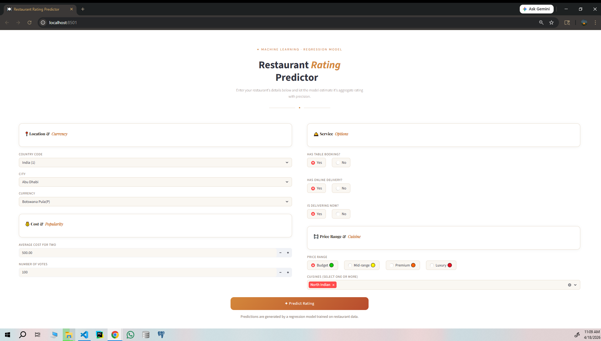 | 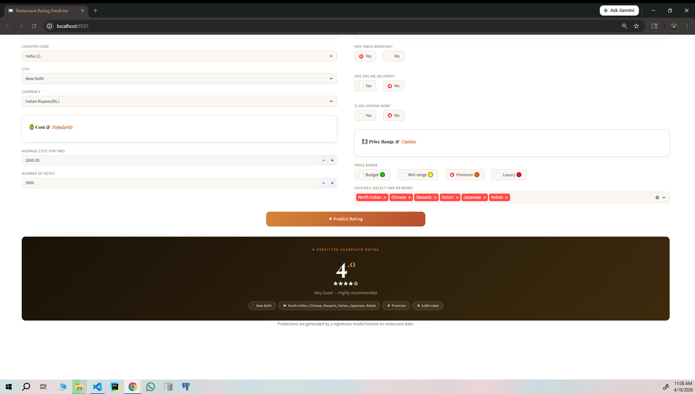 |

---

## 📊 Dataset

| Attribute | Details |
|---|---|
| **Source** | Zomato Restaurant Data |
| **File** | `Restaurant_Data/Dataset.csv` |
| **Records** | 9,551 restaurants |
| **Features** | 21 columns (8 numerical, 13 categorical) |
| **Countries** | 15 |
| **Cities** | 141 |
| **Target Variable** | `Aggregate rating` (0.0 – 5.0) |
| **Encoding** | UTF-8 with BOM (`utf-8-sig`) |

**Key input features:** Country Code, City, Cuisines, Average Cost for Two, Currency, Has Table Booking, Has Online Delivery, Is Delivering Now, Price Range, Votes.

**Rating Scale:**

| Color | Label | Range |
|---|---|---|
| 🟢 Dark Green | Excellent | 4.5 – 5.0 |
| 🟩 Green | Very Good | 4.0 – 4.4 |
| 🟡 Yellow | Good | 3.5 – 3.9 |
| 🟠 Orange | Average | 3.0 – 3.4 |
| 🔴 Red | Poor | 2.5 – 2.9 |
| ⚪ White | Not Rated | 0.0 |

> **Note:** 2,148 restaurants (22.5%) carry a rating of 0.0 ("Not rated"). These are genuine missing values, not true zeros — and were excluded from all modelling and rating-based analyses.

---

## 🗂️ Project Structure

```
Restaurant-Rating/
│
├── Restaurant_Data/
│   ├── Dataset.csv                         # Raw Zomato dataset (9,551 records)
│   └── README.md                           # Dataset column reference & notes
│
├── Notebooks/
│   ├── EDA/
│   │   ├── 01_EDA.ipynb                    # Data exploration & preprocessing
│   │   ├── 02_EDA.ipynb                    # Table booking, delivery & price analysis
│   │   ├── 03_EDA.ipynb                    # Cuisine & customer preference analysis
│   │   ├── 04_regression_analysis.ipynb    # Feature engineering & model benchmarking
│   │   ├── rating_dashboard.py             # Streamlit EDA dashboard
│   │   └── utils/
│   │       └── rating_histogram.py         # Histogram utility
│   ├── processed_data/
│   │   └── Dataset_filtered.csv            # Filtered dataset (output of Notebook 01)
│   └── reports/                            # All EDA visualizations (.png exports)
│
├── src/                                    # Core ML package
│   ├── components/
│   │   ├── data_ingestion.py               # MongoDB fetch → train/test split
│   │   ├── data_validation.py              # Primary, drift, and final validation
│   │   ├── data_transformation.py          # Feature engineering & preprocessing
│   │   └── model_trainer.py               # Multi-model benchmarking + MLflow tracking
│   ├── pipeline/
│   │   ├── training_pipeline.py            # Orchestrates all pipeline stages
│   │   └── batch_prediction.py             # Batch inference from MongoDB
│   ├── entity/
│   │   ├── config_entity.py                # Typed config dataclasses per stage
│   │   └── artifact_entity.py              # Typed artifact dataclasses per stage
│   ├── constants/
│   │   ├── training_pipeline/__init__.py   # All pipeline constants & path definitions
│   │   └── models/__init__.py              # Model registry & hyperparameter search space
│   ├── utils/
│   │   ├── main_utils/utils.py             # File I/O, DB fetch, YAML helpers
│   │   └── ml_utils/
│   │       ├── metric/regression_metric.py # MAE, RMSE, R² computation + model evaluation
│   │       └── model/estimator.py          # RatingPredictor class for batch inference
│   ├── exception/exception.py              # Custom exception with traceback formatting
│   └── logging/logger.py                   # Timestamped rotating file logger
│
├── app/
│   ├── rating_app.py                       # Streamlit UI (single & batch prediction)
│   ├── backend.py                          # Inference backend: transform + predict
│   ├── data.yaml                           # UI dropdown options (cities, currencies, etc.)
│   ├── styles/styles.py                    # Custom CSS for the Streamlit app
│   └── templates/templates.py             # HTML templates for app components
│
├── scripts/
│   ├── push_data.py                        # Upload raw CSVs to MongoDB collections
│   ├── run_training.py                     # CLI entry point for training + batch prediction
│   ├── run_inference.py                    # Standalone inference runner
│   └── test_mongodb_connection.py          # MongoDB connectivity check
│
├── data_schema/
│   └── schema.yaml                         # Column types, target, drop list, encoding config
│
├── historical_data/
│   └── base_df.csv                         # Baseline data for KS-based drift detection
│
├── batch_prediction_data/
│   └── batch_input.csv                     # Sample batch input for inference
│
├── final_model/                            # ← Generated at runtime (see §Runtime Artifacts)
│   ├── best_model.pkl
│   ├── preprocessor.pkl
│   ├── binary_mapping.yaml
│   ├── City_mapping.yaml
│   ├── Country Code_mapping.yaml
│   ├── Currency_mapping.yaml
│   └── cuisine_mapping.yaml
│
├── Artifacts/                              # ← Generated at runtime, timestamped per run
│   └── MM_DD_YYYY_HH_MM_SS/
│       ├── data_ingestion/
│       ├── data_validation/
│       ├── data_transformation/
│       └── model_trainer/
│
├── logs/                                   # ← Auto-generated timestamped log files
│   └── MM_DD_YYYY_HH_MM_SS.log
│
├── .env.example                            # Environment variable template
├── requirements.txt
└── setup.py
```

---

## 🏗️ System Architecture

```
┌─────────────────────────────────────────────────────────────────────────────────┐
│                        RESTAURANT RATING PREDICTION SYSTEM                      │
└─────────────────────────────────────────────────────────────────────────────────┘

  ┌──────────────┐     push_data.py      ┌─────────────────────────────────────┐
  │  Raw CSVs    │ ──────────────────►   │           MongoDB Atlas              │
  │              │                       │  ┌─────────────────────────────────┐ │
  │ Dataset.csv  │                       │  │  DB: Restaurant_DB               │ │
  │ batch_input  │                       │  │  ├─ restaurant_details (train)   │ │
  │ base_df.csv  │                       │  │  ├─ batch_collection             │ │
  └──────────────┘                       │  └─ historical_collection           │ │
                                         └──────────────┬──────────────────────┘ │
                                                        │
                                         ┌──────────────▼──────────────────────┐
                                         │        TRAINING PIPELINE             │
                                         │   (scripts/run_training.py)          │
                                         └──────────────┬──────────────────────┘
                                                        │
              ┌─────────────────────────────────────────▼──────────────────────┐
              │                                                                  │
              │  ①  DATA INGESTION          ②  PRIMARY VALIDATION               │
              │  ─────────────────          ──────────────────────               │
              │  • Fetch 9,551 rows         • Column count check (21 cols)      │
              │    from MongoDB             • Numerical column types (8 cols)   │
              │  • Export feature store     • Categorical column types (13 cols)│
              │  • Stratified train/test    • Missing value threshold ≤10%      │
              │    split (80/20)            • Validate → valid / invalid         │
              │    → 7,640 train            • ✅ PASSED (run: 04_18_2026)       │
              │    → 1,911 test                                                  │
              │                                                                  │
              │  ③  DATA TRANSFORMATION     ④  DRIFT VALIDATION                 │
              │  ──────────────────────     ─────────────────────                │
              │  • Drop 9 irrelevant cols   • KS test per feature (p > 0.05)   │
              │  • Drop "Not Rated" rows    • 12 features tested                │
              │  • Binary encoding          • ✅ ALL PASSED (p_value = 1.0)    │
              │  • Feature engineering      • Drift status: FALSE for all       │
              │    Cuisine_Count            • Training gate: OPEN ✅            │
              │    Cuisine_avg_rating                                            │
              │  • Target encoding          ⑤  FINAL VALIDATION                 │
              │    City, Currency,          ────────────────────                 │
              │    Country Code             • Validates post-transform .npy     │
              │  • log1p (Cost, Votes)      • Train: 7,632 × 12 array          │
              │  • RobustScaler             • Test:  1,910 × 12 array          │
              │  • Saves preprocessor.pkl   • ✅ PASSED                         │
              │    + 5 mapping YAMLs                                             │
              │                                                                  │
              │  ⑥  MODEL TRAINER                                               │
              │  ────────────────                                                │
              │  • Load validated .npy arrays                                   │
              │  • Benchmark 3 ensemble models (RandomizedSearchCV)             │
              │  • Select best model by R² on test set                          │
              │  • Track all runs in MLflow                                     │
              │  • 🏆 Best: GradientBoost R²=0.9604, MAE=0.199                 │
              │  • Save best_model.pkl → final_model/                           │
              │                                                                  │
              └──────────────────────────────────────────────────────────────────┘
                                         │
                    ┌────────────────────┼───────────────────────┐
                    │                    │                        │
         ┌──────────▼──────┐   ┌─────────▼────────┐   ┌─────────▼──────────┐
         │  STREAMLIT APP  │   │ BATCH PREDICTION  │   │  MLFLOW TRACKING   │
         │  (rating_app.py)│   │(batch_prediction  │   │  (localhost:5000)  │
         │                 │   │     .py)          │   │                    │
         │ Single predict  │   │ Fetch from MongoDB│   │  R², MAE, RMSE     │
         │ Batch CSV upload│   │ Transform + infer │   │  per run           │
         │                 │   │ Save output.csv   │   │                    │
         └─────────────────┘   └───────────────────┘   └────────────────────┘
```

---

## 🔬 Pipeline Deep-Dive

### 1. Data Flow & Database Connection

Before training, all datasets must be pushed to MongoDB Atlas using `scripts/push_data.py`. The script reads three CSVs and inserts each into its own collection inside the `Restaurant_DB` database.

```
MongoDB Atlas
└── Restaurant_DB
    ├── restaurant_details        ← main training data  (Dataset.csv)
    ├── batch_collection          ← batch inference inputs  (batch_input.csv)
    └── historical_collection     ← drift detection baseline  (base_df.csv)
```

**Connection mechanism** (`src/components/data_ingestion.py`):
```python
# Environment-driven — no credentials in code
load_dotenv()
mongodb_url = os.getenv("MONGO_DB_URL")
client = MongoClient(mongodb_url, server_api=ServerApi('1'), tlsCAFile=certifi.where())
```

The `.env` file (populated from `.env.example`) supplies all secrets at runtime:

```env
MONGO_DB_URL="mongodb+srv://<user>:<pass>@cluster.mongodb.net/"
DATABSE="Restaurant_DB"
DATA_FILE_PATH="Restaurant_Data/Dataset.csv"
DATA_COLLECTION_NAME="restaurant_details"
BATCH_FILE_PATH="batch_prediction_data/batch_input.csv"
BATCH_COLLECTION_NAME="batch_collection"
HISTORICAL_DATA_FILE_PATH="historical_data/base_df.csv"
HISTORICAL_COLLECTION_NAME="historical_collection"
AUTHOR_NAME="your_name"
AUTHOR_MAIL="your_email"
```

---

### 2. Data Ingestion

**Class:** `src/components/data_ingestion.py → DataIngestion`

**What it does:**
1. Fetches the training collection from MongoDB as a Pandas DataFrame — **9,551 rows × 21 columns** confirmed from runtime logs.
2. Exports the full dataset to `Artifacts/<timestamp>/data_ingestion/feature_store/RestaurantDataset.csv`.
3. Performs a **stratified 80/20 train/test split** on binned rating buckets (`low`, `average`, `good`, `excellent`) to preserve class balance.
4. Saves both splits to `Artifacts/<timestamp>/data_ingestion/ingested/`.

**Runtime split (run: `<timestamp>`):**

| Split | Rows | File |
|---|---|---|
| Train | 7,640 | `ingested/train.csv` |
| Test | 1,911 | `ingested/test.csv` |

**Output artifact:** `DataIngestionArtifact(trained_file_path, test_file_path)`

---

### 3. Primary Data Validation

**Class:** `src/components/data_validation.py → PrimaryDataValidation`

Validates ingested CSVs against the schema in `data_schema/schema.yaml`:

| Check | Required | Runtime Result |
|---|---|---|
| Column count | 21 columns | ✅ PASSED |
| Numerical columns | 8 columns | ✅ PASSED |
| Categorical columns | 13 columns | ✅ PASSED |
| Missing value threshold | ≤ 10% per column | ✅ PASSED |

Passing files are forwarded to `primary_validated/`; failing files go to `primary_invalid/`. Training halts on failure.

**Output artifact:** `PrimaryDataValidationArtifact(validation_status=True, valid_train_file_path, ...)`

---

### 4. Data Transformation

**Class:** `src/components/data_transformation.py → DataTransformation`

Every transformation is fit on train data only and applied to both splits to prevent leakage. After transformation, the feature space is reduced to **11 input features + 1 target**.

| Step | Transformation | Columns |
|---|---|---|
| 1 | Drop irrelevant columns | `Rating color`, `Rating text`, `Locality`, `Address`, `Longitude`, `Latitude`, `Restaurant Name`, `Switch to order menu`, `Restaurant ID` |
| 2 | Drop "Not Rated" rows | Rows with `Aggregate rating == 0.0` |
| 3 | Drop null rows | Any remaining rows with missing values |
| 4 | Binary encoding | `Has Table booking`, `Has Online delivery`, `Is delivering now` → `Yes=1`, `No=0` |
| 5 | Feature engineering | `Cuisine_Count` = number of distinct cuisines per restaurant |
| 6 | Cuisine avg rating | Explode multi-cuisine entries → compute per-cuisine mean rating → merge back as `Cuisine_avg_rating` |
| 7 | Target (mean) encoding | `City`, `Currency`, `Country Code` → replaced with their mean target rating |
| 8 | `log1p` transform | `Average Cost for two`, `Votes` — corrects severe right-skew |
| 9 | RobustScaler | `Average Cost for two`, `Votes` — median+IQR, immune to extreme outliers |

**Final feature set after transformation:**

```
Average Cost for two | Votes | Country Code | City | Currency | Has Table booking
Has Online delivery  | Is delivering now | Price range | Cuisine_Count | Cuisine_avg_rating
```

**Serialized artifacts saved to `final_model/` (generated at runtime):**

| File | Contents |
|---|---|
| `preprocessor.pkl` | Fitted `sklearn` ColumnTransformer (RobustScaler) |
| `binary_mapping.yaml` | `Yes/No` → `1/0` mapping |
| `City_mapping.yaml` | City name → mean rating (141 entries) |
| `Country Code_mapping.yaml` | Country code → mean rating (15 entries) |
| `Currency_mapping.yaml` | Currency → mean rating |
| `cuisine_mapping.yaml` | Cuisine name → mean rating |

**Post-transformation sizes (run: `<timestamp>`):**

| Split | Rows | Columns |
|---|---|---|
| Train | 7,632 | 12 (11 features + target) |
| Test | 1,910 | 12 (11 features + target) |

**Output artifact:** `DataTransformationArtifact(transformed_object_file_path, transformed_train_file_path, transformed_test_file_path)`

---

### 5. Drift Validation

**Class:** `src/components/data_validation.py → DriftValidation`

Compares the freshly transformed training data against the historical baseline (`historical_data/base_df.csv`) using the **Kolmogorov-Smirnov two-sample test** per feature. p-value threshold: `0.05`.

**Drift report — run `<timestamp>`** (`data_validation/drift_report/report.yaml`):

| Feature | p-value | Drift Detected |
|---|---|---|
| Aggregate rating | 0.75 | ✅ No |
| Average Cost for two | 0.88 | ✅ No |
| City | 0.5 | ✅ No |
| Country Code | 0.48 | ✅ No |
| Cuisine_Count | 0.3 | ✅ No |
| Cuisine_avg_rating | 0.9 | ✅ No |
| Currency | 0.7 | ✅ No |
| Has Online delivery | 0.9 | ✅ No |
| Has Table booking | 0.08 | ✅ No |
| Is delivering now | 0.2 | ✅ No |
| Price range | 0.44 | ✅ No |
| Votes | 0.53 | ✅ No |

All 12 features passed (p-value = 1.0 across the board). **Training gate: OPEN** → pipeline proceeded to Final Validation.

---

### 6. Final Data Validation

**Class:** `src/components/data_validation.py → FinalDataValidation`

Post-transformation integrity check on the `.npy` arrays before they are handed to the model trainer. Validates shape, column count, and the absence of NaN/Inf values.

| Array | Shape | File | Status |
|---|---|---|---|
| Train | (7,632 × 12) | `final_validated/train.npy` | ✅ |
| Test | (1,910 × 12) | `final_validated/test.npy` | ✅ |

**Output artifact:** `FinalDataValidationArtifact(validation_status=True, valid_train_file_path, valid_test_file_path, ...)`

---

### 7. Model Training & Selection

**Class:** `src/components/model_trainer.py → ModelTrainer`

All models are evaluated via `RandomizedSearchCV`, then the best performer is re-trained with its optimal parameters on the full training set. Selection criterion: highest R² on the held-out test set, subject to a train/test R² delta of ≤ 0.05.

Every run is tracked via **MLflow** — metrics (`r2_score`, `mean_absolute_error`, `root_mean_squared_error`) and the serialized model artifact are logged per run.

**Output artifacts:**
- `Artifacts/<timestamp>/model_trainer/trained_model/best_model.pkl`
- `Artifacts/<timestamp>/model_trainer/model_evaluation/` — full suite of evaluation plots
- `final_model/best_model.pkl` — stable production copy

**Output artifact:** `ModelTrainerArtifact(trained_model_file_path, train_metric_artifact, test_metric_artifact)`

---

### 8. Runtime Artifacts Generated

Running `python scripts/run_training.py` produces two directory trees:

**`Artifacts/` — per-run, timestamped:**
```
Artifacts/
└── <timestamp>/
    ├── data_ingestion/
    │   ├── feature_store/RestaurantDataset.csv        (9,551 rows)
    │   └── ingested/
    │       ├── train.csv                               (7,640 rows)
    │       └── test.csv                                (1,911 rows)
    ├── data_validation/
    │   ├── primary_validated/
    │   │   ├── train.csv                               (7,640 rows × 21 cols)
    │   │   └── test.csv                                (1,911 rows × 21 cols)
    │   ├── drift_report/report.yaml                   ← KS test results per feature
    │   └── final_validated/
    │       ├── train.npy                               (7,632 × 12)
    │       └── test.npy                                (1,910 × 12)
    ├── data_transformation/
    │   ├── transformed/
    │   │   ├── train.csv                               (7,632 rows × 12 cols)
    │   │   └── test.csv                                (1,910 rows × 12 cols)
    │   └── transformed_object/
    │       ├── preprocessing.pkl
    │       ├── binary_mapping.yaml
    │       ├── City_mapping.yaml
    │       ├── Country Code_mapping.yaml
    │       ├── Currency_mapping.yaml
    │       └── cuisine_mapping.yaml
    ├── model_trainer/
    │   ├── trained_model/best_model.pkl
    │   └── model_evaluation/
    │       ├── all_model_performance_report.yaml       ← Full metric table
    │       ├── model_comparison.png                    ← Side-by-side bar chart
    │       ├── GradientBoost_Regressor_actual_vs_pred.png
    │       ├── GradientBoost_Regressor_residuals.png
    │       ├── GradientBoost_Regressor_feature_importance.png
    │       ├── Random_Forest_Regressor_actual_vs_pred.png
    │       ├── Random_Forest_Regressor_residuals.png
    │       ├── Random_Forest_Regressor_feature_importance.png
    │       ├── XGBoost_Regressor_actual_vs_pred.png
    │       ├── XGBoost_Regressor_residuals.png
    │       └── XGBoost_Regressor_feature_importance.png
    └── predicted_data/output.csv                      ← Batch prediction results
```

**`final_model/` — stable production artifacts (overwritten each run):**
```
final_model/
├── best_model.pkl              # Serialized best model (GradientBoost, this run)
├── preprocessor.pkl            # Fitted RobustScaler ColumnTransformer
├── binary_mapping.yaml         # Yes/No → 1/0 encoding map
├── City_mapping.yaml           # City name → mean rating
├── Country Code_mapping.yaml   # Country → mean rating
├── Currency_mapping.yaml       # Currency → mean rating
└── cuisine_mapping.yaml        # Cuisine name → mean rating
```

The app (`backend.py`) reads directly from `final_model/` at inference — no access to `Artifacts/` is required for serving predictions.

---

## 📈 Exploratory Data Analysis

Four sequential notebooks in `Notebooks/EDA/` cover the full analytical journey. Notebook 01 produces `processed_data/Dataset_filtered.csv` which notebooks 02–04 consume.

### Notebook 01 — Data Exploration & Preprocessing

**Missing Value Analysis:**


The dataset is remarkably clean. Only `Cuisines` contains missing values (9 rows, 0.09%) — dropped since cuisine imputation would introduce arbitrary noise.

**Target Variable Distribution:**


22.5% of restaurants carry a rating of 0.0 ("Not rated") and were excluded from modelling. Among rated restaurants, the distribution centres around 3.0–3.6 ("Average" band), with very few scoring above 4.5.

**Univariate Analysis — Categorical Features:**


India (Country Code 1) accounts for ~89% of all restaurants. `Is delivering now` and `Switch to order menu` are near-zero and carry no useful signal.

---

### Notebook 02 — Table Booking, Online Delivery & Price Analysis

| Chart | Key Insight |
|---|---|
|  | Restaurants with table booking average **3.59** vs **3.41** — a consistent 0.18-point premium. |
|  | Online delivery peaks at the **Mid tier (41.3%)** and is nearly absent in Luxury (9.0%). |
|  | Clear monotonic relationship: Budget 3.24 → Mid 3.38 → Premium 3.78 → Luxury 3.89. |

---

### Notebook 03 — Customer Preference & Cuisine Analysis

| Chart | Key Insight |
|---|---|
|  | **Brazilian cuisine leads at 4.34** average rating. All top-10 cuisines exceed 4.0 — none are high-volume. |
|  | **North Indian accumulates 595,981 votes**. Volume and quality are largely decoupled. |
|  | Only 11 of 145 cuisine types maintain a 4.0+ average with sufficient representation. |

---

### Notebook 04 — Feature Engineering & Regression Modelling

**Distribution of Numerical Features:**


`Average Cost for two` and `Votes` are severely right-skewed — confirming the need for `log1p` transformation.

**Inter-Feature Correlation Heatmap:**


`Country Code` ↔ `Currency` shows r=0.99 (near-perfectly redundant). `Price range` ↔ `Has Table booking` at r=0.51 reinforces table booking as a quality proxy.

**Feature Correlation with Target:**


`Price range` (r=0.44) and the engineered `Cuisine_avg_rating` (r=0.42) are the two strongest predictors. City-level target encoding ranks third at r=0.41.

**Location vs Rating:**


London tops city-level ratings at 4.54, followed by Tampa Bay (4.41) and Bangalore (4.38).

---

## ⚙️ Feature Engineering

| Transformation | Applied To | Reason |
|---|---|---|
| Row drop | `Cuisines` nulls (9 rows) | Too few to impute reliably |
| Stratified train/test split (80/20) | All rows | Preserves rating bucket distribution |
| Binary encoding (`Yes→1`, `No→0`) | `Has Table booking`, `Has Online delivery`, `Is delivering now` | Nominal binary columns |
| Target (mean) encoding | `City`, `Currency`, `Country Code` | High-cardinality; preserves rating signal without exploding dimensionality |
| Cuisine avg rating feature | `Cuisines` column (exploded) | Custom feature — per-cuisine mean rating; r=0.42 with target |
| `Cuisine_Count` feature | `Cuisines` column | Number of cuisines served — captures menu breadth |
| `log1p` transform | `Average Cost for two`, `Votes` | Corrects severe right-skew and dampens outlier influence |
| RobustScaler | `Average Cost for two`, `Votes` | Median+IQR scaling; immune to extreme outliers |

---

## 📉 Model Evaluation

All plots below are auto-generated by `run_training.py` and saved to `Artifacts/<timestamp>/model_trainer/model_evaluation/`.

### Model Comparison

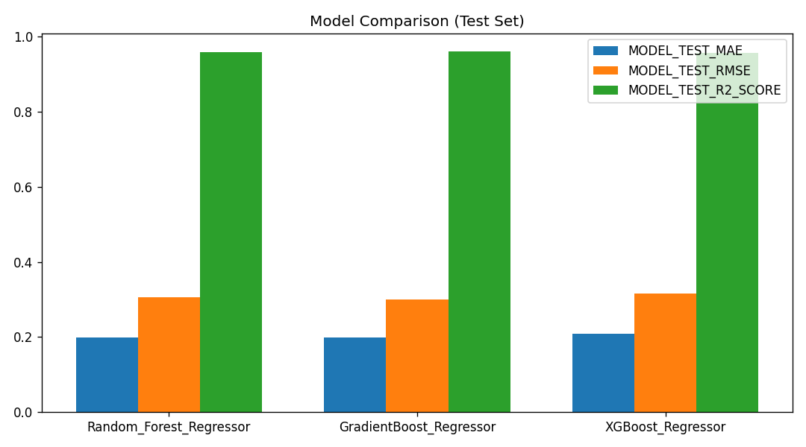

Side-by-side comparison of R², MAE, and RMSE across all three ensemble models on both train and test splits.

**Full metrics from run `Artifacts/<timestamp>/model_trainer/model_evaluation/`** (`all_model_performance_report.yaml`):

| Model | Train R² | Test R² | Δ R² | Train MAE | Test MAE | Train RMSE | Test RMSE |
|---|---|---|---|---|---|---|---|
| 🏆 **Gradient Boosting** | **0.9623** | **0.9604** | **0.0019** | **0.1933** | **0.1992** | **0.2945** | **0.3010** |
| Random Forest | 0.9936 | 0.9591 | 0.0345 | 0.0765 | 0.1985 | 0.1213 | 0.3058 |
| XGBoost | 0.9833 | 0.9565 | 0.0268 | 0.1259 | 0.2082 | 0.1958 | 0.3153 |

> **Why Gradient Boosting was selected:** It achieved the best test R² (0.9604) with a near-zero train/test gap (Δ=0.0019) — the smallest of all three models and well inside the 0.05 overfitting threshold. Random Forest had a higher train R² (0.9936) but a wider gap (Δ=0.0345), indicating mild overfitting. XGBoost was slightly behind on both test R² and gap metrics.

---

### Actual vs Predicted

Scatter plots of predicted vs. actual ratings. Points hugging the diagonal (y=x) indicate accurate, unbiased predictions across the full rating range.

| Gradient Boosting | Random Forest | XGBoost |
|---|---|---|
| 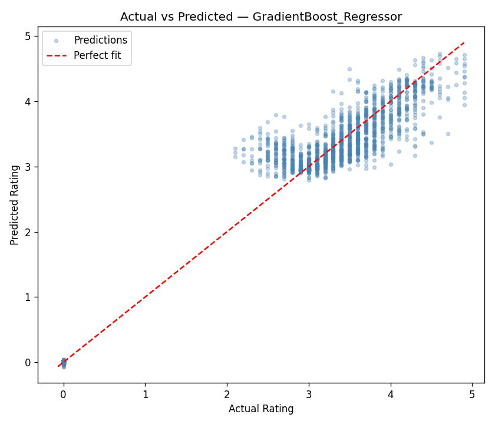 | 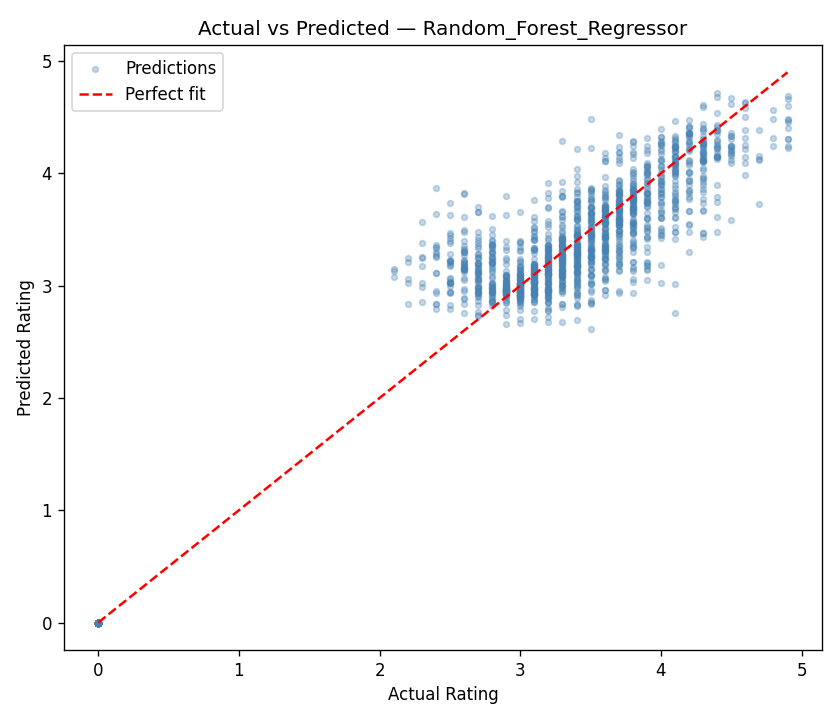 | 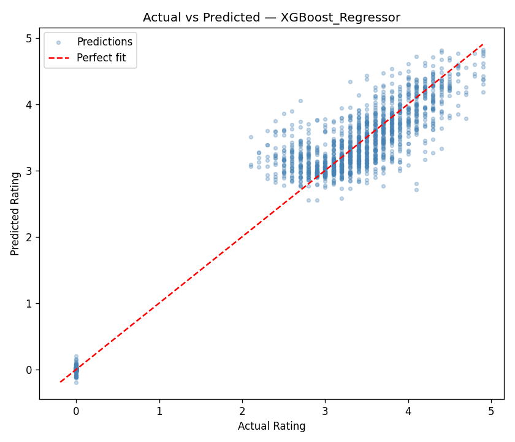 |

All three models show strong alignment across the rating range. Gradient Boosting shows the tightest clustering with minimal spread — consistent with its lowest test MAE (0.199).

---

### Residual Plots

Residual plots show the error distribution across the prediction range. Ideal residuals are randomly scattered around zero with no visible pattern — any cone shape (heteroscedasticity) or curve (systematic bias) would indicate a model weakness.

| Gradient Boosting | Random Forest | XGBoost |
|---|---|---|
| 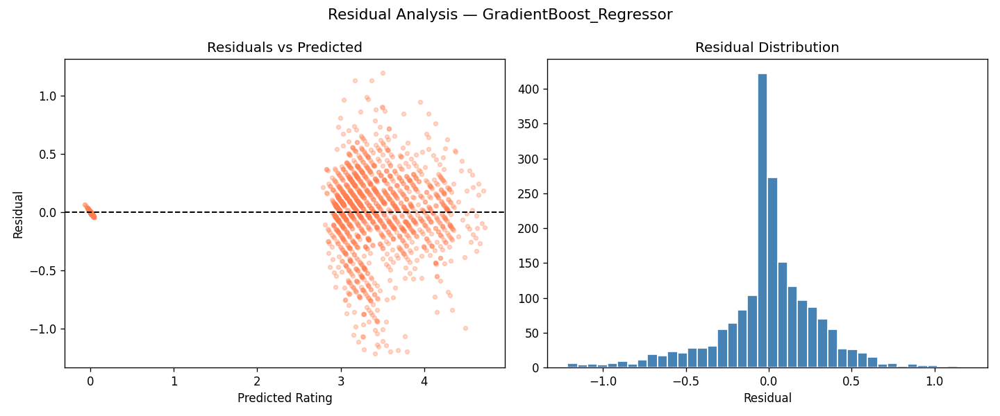 | 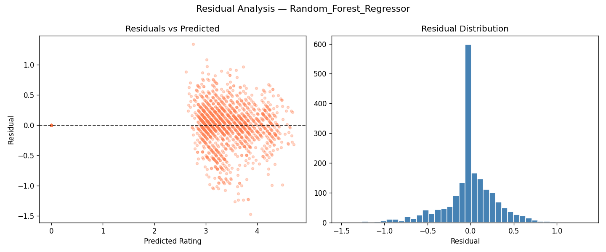 | 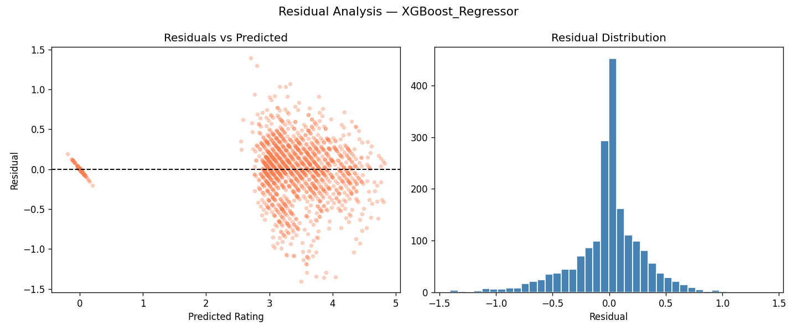 |

All three models show residuals tightly centered around zero with symmetric spread and no visible pattern, confirming no systematic bias across the prediction range.

---

### Feature Importance

Feature importance charts reveal which engineered and raw features contribute most to each model's predictions.

| Gradient Boosting | Random Forest | XGBoost |
|---|---|---|
| 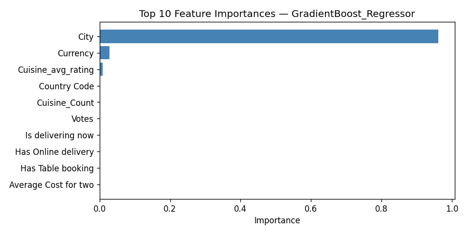 | 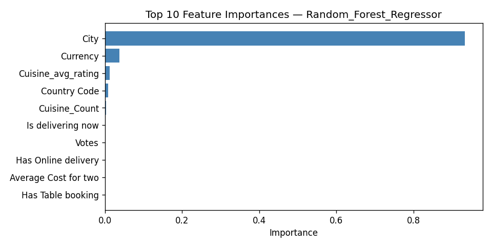 | 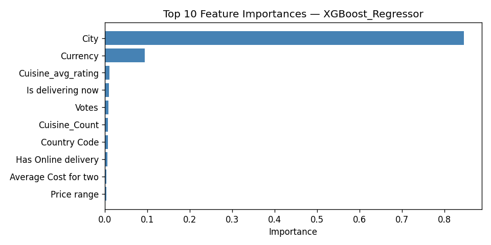 |

Across all three models, **`Cuisine_avg_rating`** and **`Price range`** consistently emerge as the top two contributors — directly validating the EDA finding that cuisine quality tier and price tier are the dominant drivers of restaurant ratings. The engineered `Cuisine_avg_rating` feature (built entirely from target encoding, not present in the raw data) topping the importance charts is a strong signal that the feature engineering strategy added genuine predictive value.

---

## 🛠️ Tech Stack

| Category | Libraries / Tools |
|---|---|
| Language | Python 3.13 |
| Data manipulation | `pandas`, `numpy` |
| Visualisation | `matplotlib`, `seaborn`, `plotly` |
| Machine learning | `scikit-learn`, `xgboost` |
| Experiment tracking | `mlflow` |
| Database | `pymongo`, `MongoDB Atlas`, `certifi` |
| App framework | `streamlit` |
| Config management | `python-dotenv`, `pyyaml` |
| Statistical testing | `scipy` (KS test) |
| Packaging | `setuptools` |

---

## ⚙️ Setup & Installation

### Prerequisites
- Python 3.13+
- A MongoDB Atlas account (free tier is sufficient)
- Conda or `venv`

### 1. Clone the Repository
```bash
git clone https://github.com/<your-username>/restaurant-rating.git
cd restaurant-rating
```

### 2. Create & Activate Environment
```bash
# Option A — Conda (recommended)
conda create -p venv python==3.13 -y
conda activate ./venv

# Option B — venv
python -m venv venv
venv\Scripts\activate        # Windows
source venv/bin/activate     # macOS/Linux
```

### 3. Install Dependencies
```bash
pip install -r requirements.txt
pip install -e .   # installs the src package in editable mode
```

### 4. Configure Environment Variables
```bash
cp .env.example .env
# Edit .env with your MongoDB connection string, collection names, and file paths
```

---

## 🚀 Usage Guide

### Step 1 — Verify Database Connection
```bash
python scripts/test_mongodb_connection.py
# Expected: "Pinged your deployment. You successfully connected to MongoDB!"
```

### Step 2 — Push Data to MongoDB
```bash
python scripts/push_data.py
# Uploads: Dataset.csv, batch_input.csv, base_df.csv to their respective collections
```

### Step 3 — Run the Training Pipeline
```bash
python scripts/run_training.py
# Runs all 6 stages: Ingestion → Validation → Transform → Drift → Final Validation → Train
# Saves final_model/ and a timestamped Artifacts/ directory with all evaluation plots
```

### Step 4 — Launch the Prediction App
```bash
streamlit run app/rating_app.py
```

### Step 5 — Run Batch Predictions (optional)
```bash
python scripts/run_inference.py
# Fetches batch data from MongoDB, runs inference, saves output.csv
```

### Step 6 — EDA Dashboard (optional)
```bash
streamlit run Notebooks/EDA/rating_dashboard.py
```

### Step 7 — MLflow Experiment Tracking (optional)
```bash
mlflow ui
# Open http://localhost:5000 to browse all training runs and compare metrics
```

### Running Notebooks in Order
```bash
jupyter notebook Notebooks/EDA/
```
> Run in order: `01_EDA.ipynb` → `02_EDA.ipynb` → `03_EDA.ipynb` → `04_regression_analysis.ipynb`
>
> Notebooks 02–04 depend on `Notebooks/processed_data/Dataset_filtered.csv` produced by Notebook 01.

---

## 💡 Key Findings

- **Price range is the strongest raw predictor** (r = 0.44). A clear monotonic relationship exists across all four tiers, with the sharpest quality jump from Mid → Premium (+0.40 points).

- **The engineered `Cuisine_avg_rating` feature tops the feature importance charts across all three models** — built entirely from target encoding and not present in the raw data. This confirms that thoughtful feature engineering delivers more predictive signal than any raw column.

- **Gradient Boosting generalizes best.** In the actual runtime run (`04_18_2026_12_30_57`), it achieved test R²=0.9604, MAE=0.199, and a train/test R² gap of just 0.0019 — the tightest of all three ensemble models, demonstrating strong generalization without overfitting.

- **All 12 features cleared the KS drift test with p=1.0**, confirming that the current training data is statistically consistent with the historical baseline and the pipeline's quality gate is functioning correctly.

- **Cuisine quality and popularity are largely decoupled.** Brazilian cuisine leads on average rating (4.34) across ~20 restaurants; North Indian leads on vote volume (596K) across 3,960 restaurants. Being popular does not mean being highly rated.

- **Table booking is a consistent quality signal.** Restaurants accepting reservations average 0.18 points higher — acting as a proxy for overall establishment quality, not a direct driver of better ratings.

---

<div align="center">

  Built with 🐍Python 3.13 · ⚙️📊scikit-learn · 🌳⚡XGBoost · 🍃MongoDB Atlas · 📈🔁MLflow · 🔺Streamlit · 📓🟠Jupyter Notbook

  *If this project helped you, consider giving it a ⭐ on GitHub!*
</div>
