# 🍽️ Restaurant Rating Analysis & Prediction

> End-to-end data science project covering exploratory data analysis, feature engineering, and regression modelling on a global restaurant dataset from Zomato.

---

## 📌 Overview

This project analyses **9,551 restaurants** across **15 countries** and **141 cities** to uncover the key factors that influence customer ratings — and then builds a predictive regression model to estimate a restaurant's aggregate rating from its attributes.

---

## 🗂️ Project Structure

```
proj/
├── batch_prediction_data
│   └── batch_input.csv
├── data-schema
│   └── schema.yaml
├── Notebooks
│   ├── EDA
│   ├── processed_data
│   ├── reports
│   └── __init__.py
├── Restaurant_Data
│   ├── Dataset.csv
│   └── README.md
├── scripts
│   ├── push_data.py
│   ├── run_inference.py
│   ├── run_training.py
│   └── test_mongodb_connection.py
├── src
│   ├── cloud
│   ├── components
│   ├── constants
│   ├── entity
│   ├── exception
│   ├── logging
│   ├── pipeline
│   ├── utils
│   └── __init__.py
├── .env.example
├── .gitignore
├── app.py
├── README.md
├── requirements.txt
├── setup.py
└── tree_generator.py
```

---

## 📊 Dataset

| Attribute | Details |
|---|---|
| **Source** | Zomato Restaurant Data |
| **Records** | 9,551 restaurants |
| **Features** | 21 columns (8 numerical, 13 categorical) |
| **Countries** | 15 |
| **Cities** | 141 |
| **Target Variable** | `Aggregate rating` (0.0 – 5.0) |

**Key features:** Restaurant name, city, country, cuisines, average cost for two, price range, table booking availability, online delivery availability, votes.

---

## 🔍 Notebook 1 — Data Exploration & Preprocessing

Initial structural inspection of the dataset covering missing values, duplicates, data types, and target variable distribution.

### Missing Value Analysis

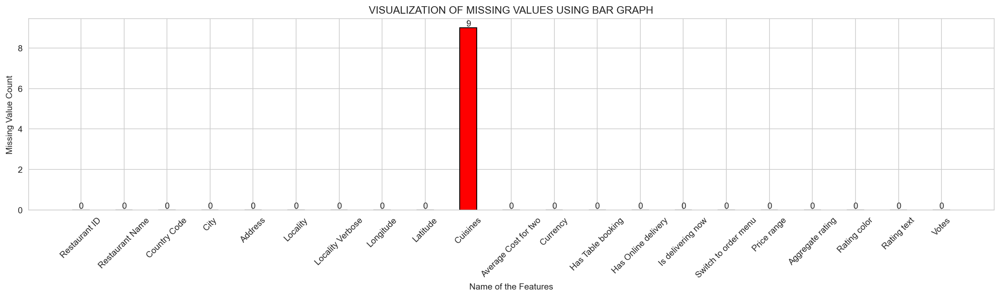

The dataset is remarkably clean. Of all 21 columns, only `Cuisines` contains missing values — exactly **9 rows (0.09%)**. Since imputing a cuisine type would introduce arbitrary noise, these rows were dropped entirely. All other features are 100% complete, which means no imputation strategies were needed elsewhere and the dataset is ready for analysis with minimal cleaning.

---

### Target Variable Distribution

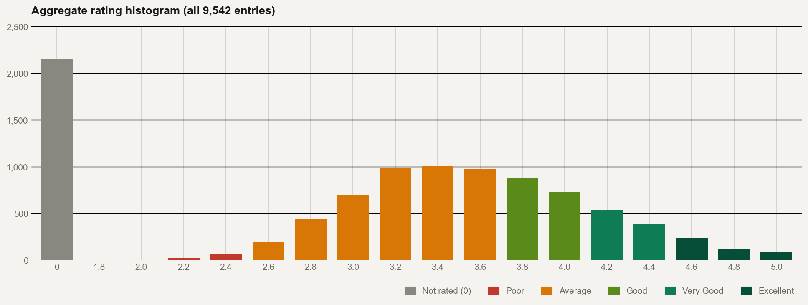

The `Aggregate rating` distribution reveals an important data quality issue: **2,148 restaurants (22.5%)** carry a rating of 0.0, labelled "Not rated" in the `Rating text` column. These are genuine missing values — not true zero ratings — and 1,054 of them have zero votes, confirming they were never reviewed. These records were excluded from all rating-based analyses to prevent distortion.

Among actually-rated restaurants, the distribution is broadly centred around **3.0–3.6** (the "Average" band), with the count gradually declining toward higher ratings. Very few restaurants score above 4.5, making "Excellent" a genuinely rare achievement in this dataset.

---

### Univariate Analysis of Categorical Features

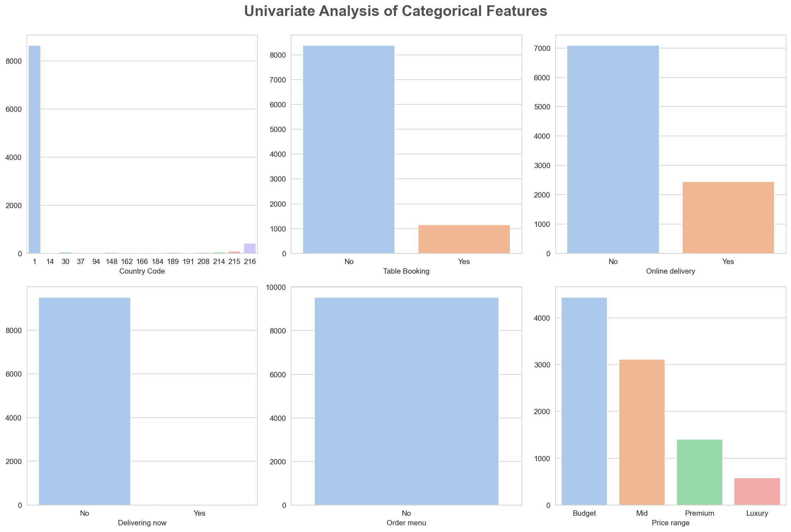

The categorical overview exposes several structural imbalances:

- **Country Code:** India (code 1) accounts for roughly **~8,500 of 9,551 restaurants (~89%)**, making geography a dominant source of distributional bias that must be accounted for in modelling.
- **Table Booking:** Only ~12% of restaurants offer table booking — a rare but informative feature.
- **Online Delivery:** ~26% offer online delivery, slightly more evenly spread than table booking.
- **Delivering Now / Switch to Order Menu:** Near-zero counts across the dataset — these columns carry almost no information and were dropped before modelling.
- **Price Range:** Budget (46.5%) and Mid (32.6%) dominate. Premium (14.7%) and Luxury (6.1%) are underrepresented but show more consistent rating patterns.

---

## 🔍 Notebook 2 — Table Booking, Online Delivery & Price Analysis

### Table Booking & Online Delivery Availability

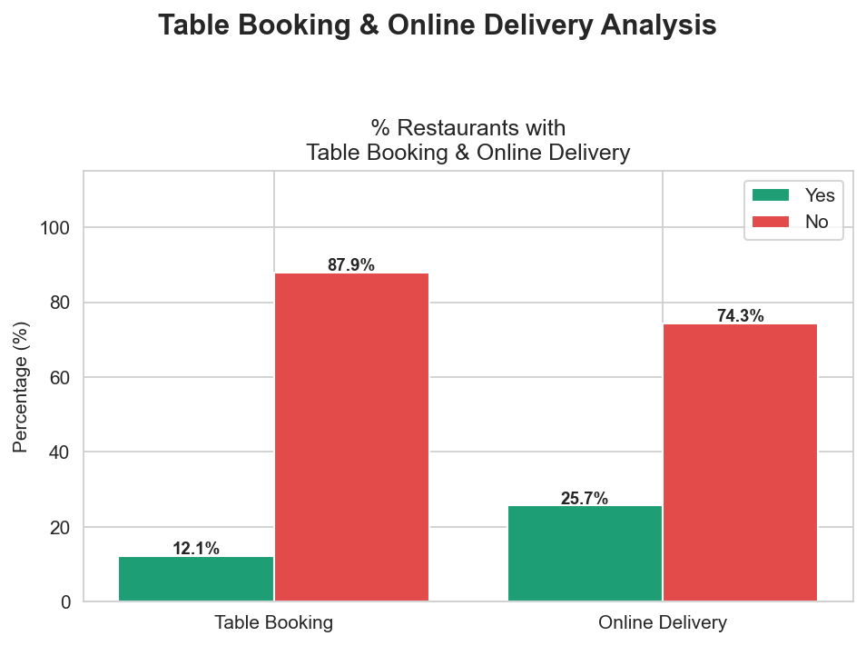

The overwhelming majority of restaurants support neither service. **87.9% have no table booking** and **74.3% have no online delivery**. These low adoption rates suggest that restaurants offering these features may represent a distinct, typically higher-quality operational tier rather than a baseline expectation.

---

### Average Rating: With vs Without Table Booking

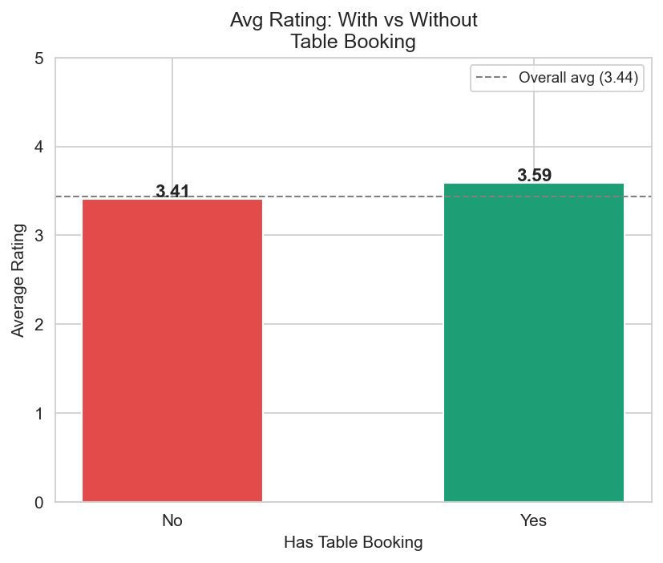

Restaurants with table booking average a rating of **3.59** compared to **3.41** for those without — a difference of 0.18 points against the overall average of 3.44. While modest in absolute size, this gap is consistent across the full dataset. Table booking appears to act as a proxy for restaurant quality tier: establishments that invest in reservation infrastructure tend to be better managed and better reviewed.

---

### Online Delivery by Price Range

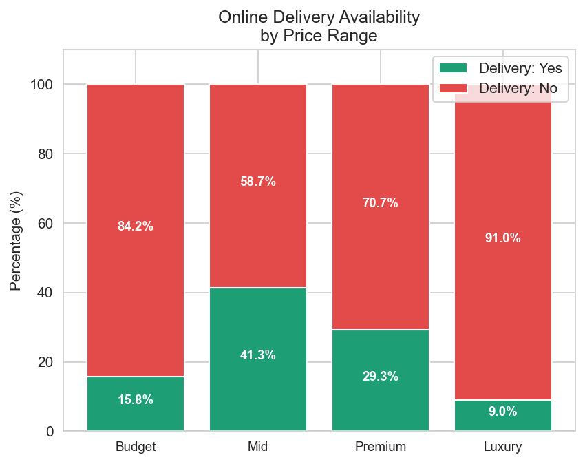

Online delivery adoption follows a non-linear pattern across price tiers. It peaks in the **Mid tier (41.3%)**, drops in Premium (29.3%), falls further in Budget (15.8%), and is nearly absent in Luxury (9.0%). The mid-tier peak makes intuitive sense: mid-range restaurants have both the operational capacity to support delivery and sufficient price-point incentive to attract delivery orders. Luxury restaurants, by contrast, rely on the in-person dining experience as a core part of their value.

---

### Price Range Distribution

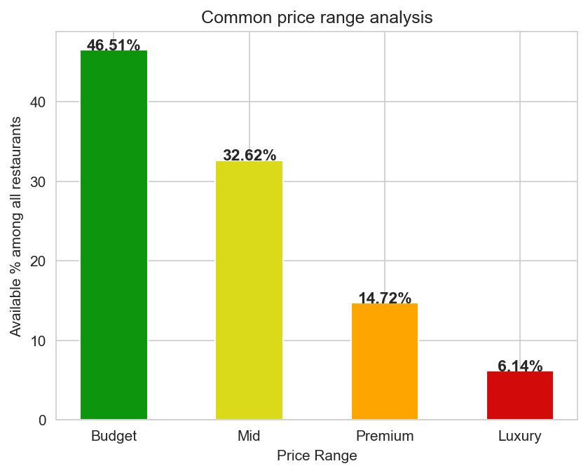

The restaurant market is heavily skewed toward affordable dining. **Budget (46.5%)** and **Mid (32.6%)** together represent nearly 80% of all restaurants. Luxury makes up only 6.1%, meaning any model trained on this data must handle class imbalance across price tiers carefully to avoid over-predicting outcomes for the majority segment.

---

### Average Rating by Price Range

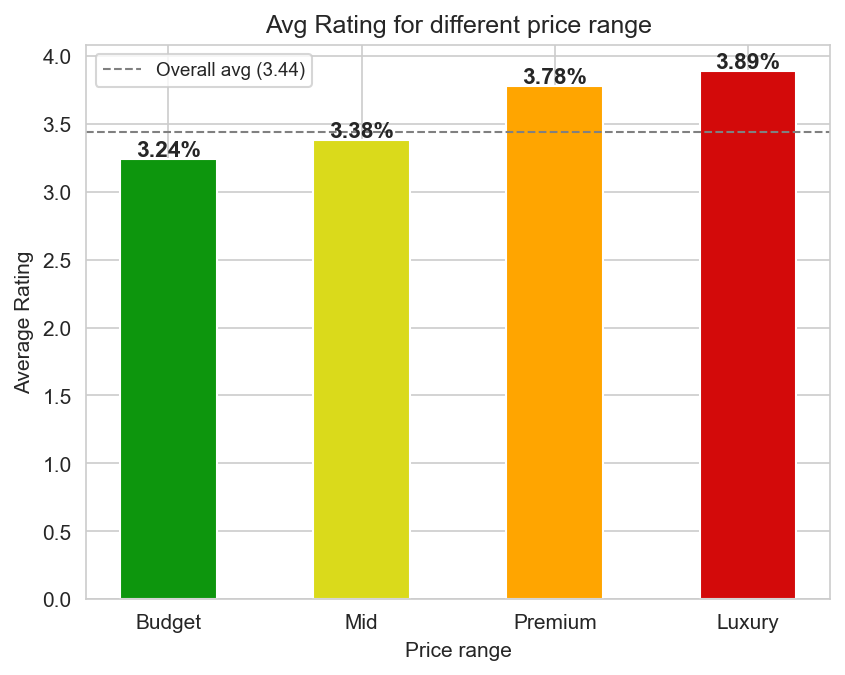

There is a clear and monotonic relationship between price tier and rating: **Budget → 3.24, Mid → 3.38, Premium → 3.78, Luxury → 3.89**. Only Premium and Luxury restaurants consistently exceed the overall average of 3.44. The jump from Mid to Premium (+0.40) is notably larger than the jump from Budget to Mid (+0.14), suggesting a meaningful quality threshold exists between the mid and premium tiers. Price range is one of the strongest single categorical predictors in the dataset.

---

## 🔍 Notebook 3 — Customer Preference & Cuisine Analysis

### Top 20 Most Represented Cuisines

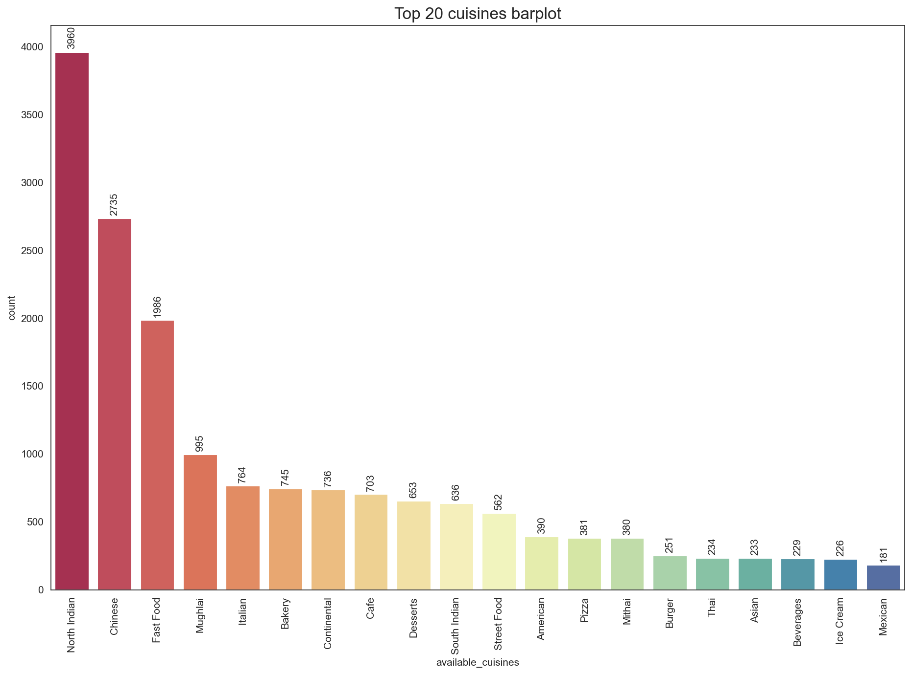

North Indian cuisine dominates the dataset with **3,960 restaurant entries**, followed by Chinese (2,735) and Fast Food (1,986) — a direct reflection of the dataset's heavy India skew. The drop-off after the top three is steep: Mughlai (995), Italian (764), and Bakery (745) are next, each with less than a quarter of North Indian's count. Cuisines like Thai, Beverages, and Mexican are niche representations, appearing in fewer than 250 restaurants each.

---

### Top 10 Cuisines by Average Rating

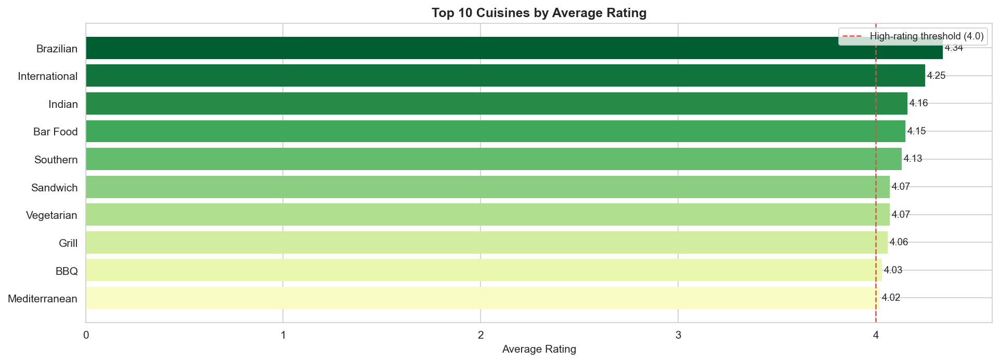

Filtering to cuisines with at least 20 restaurants for statistical reliability, **Brazilian cuisine leads with an average rating of 4.34**, followed by International (4.25), Indian (4.16), Bar Food (4.15), and Southern (4.13). Every cuisine in this top 10 exceeds 4.0 — notably, none of them are high-volume cuisines from the count chart above. This confirms a quality-over-quantity pattern: boutique and specialised dining options consistently outperform mainstream, high-frequency cuisines on customer ratings.

---

### Top 10 Most Popular Cuisines by Votes

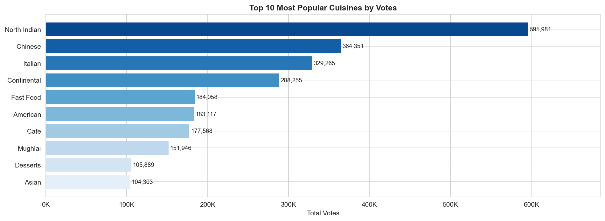

Popularity by total customer votes tells a completely different story from ratings. **North Indian accumulates 595,981 votes** — nearly double Chinese (364,351) and more than double Italian (329,265). High vote counts reflect widespread customer engagement rather than quality. Crucially, North Indian does not appear in the top-rated cuisine chart, while cuisines like Brazilian and Southern top ratings but generate minimal vote volume. Volume and quality are largely decoupled in this dataset.

---

### Customer Preference Analysis — Quality vs Scale

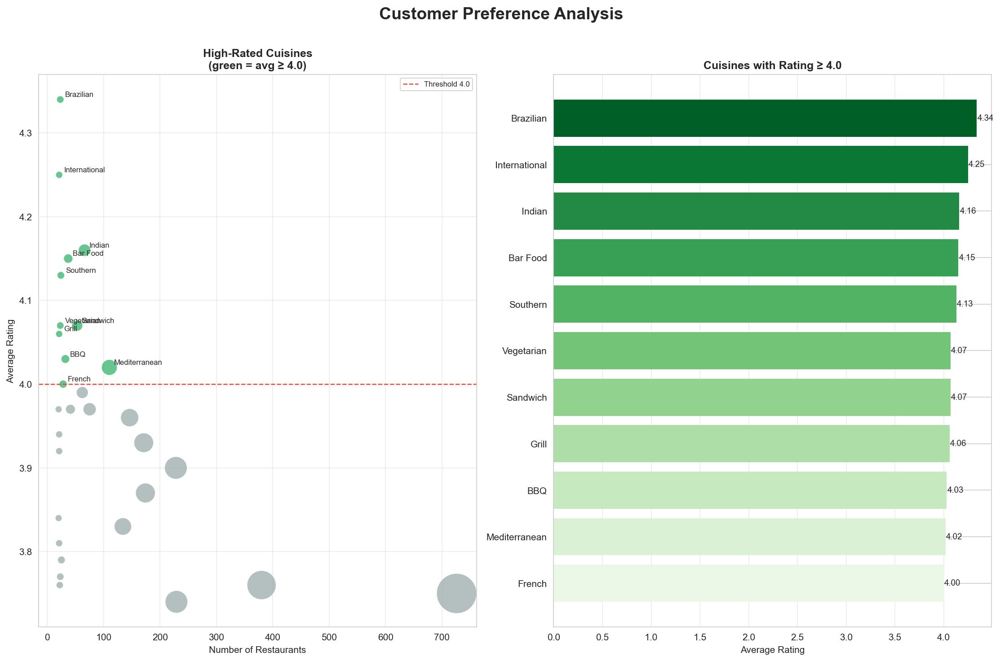

The bubble scatter plot and bar chart together visualise the **quality vs. popularity tradeoff** at a glance. High-rated cuisines (Brazilian, International, Indian) cluster in the upper-left — high average rating, low restaurant count. Mass-market cuisines cluster at lower ratings but massive restaurant counts and vote volumes. The dashed threshold at 4.0 cleanly separates the boutique, high-quality tier from the mainstream. Only **11 out of 145 unique cuisine types** maintain a 4.0+ average rating when filtered to cuisines with sufficient representation.

---

## 🔍 Notebook 4 — Feature Engineering & Regression Modelling

### Distribution Analysis of Numerical Features

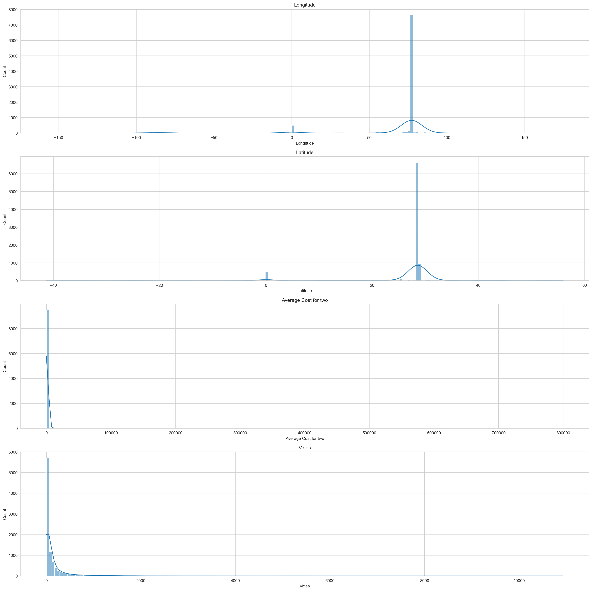

The longitude and latitude distributions both spike sharply around India's geographic coordinates (~75–80°E, ~20–30°N), visually confirming the geographic concentration of the dataset. Both `Average Cost for two` and `Votes` are severely right-skewed with long tails and extreme outliers — the x-axis extends to 800,000 for cost and 10,000+ for votes. These distributions made `log1p` transformation essential to compress the scale and reduce the disproportionate influence of outlier restaurants on model training.

---

### Inter-Feature Correlation Heatmap

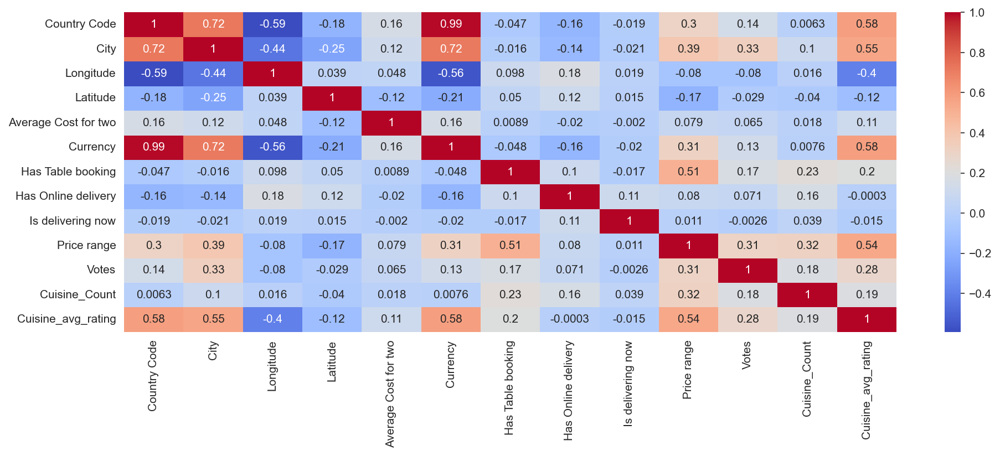

Several strong inter-feature correlations inform feature selection and encoding decisions:

- `Country Code` ↔ `Currency`: r = **0.99** — near-perfect correlation since each country uses a unique currency. One of these is effectively redundant; `Currency` was target-encoded but carries the same geographic information as `Country Code`.
- `Country Code` ↔ `City`: r = **0.72** — cities cluster by country, so these two encode overlapping geographic signals.
- `Price range` ↔ `Has Table booking`: r = **0.51** — upscale restaurants are significantly more likely to accept reservations, reinforcing table booking as a quality proxy.
- `Cuisine_avg_rating` ↔ `Price range`: r = **0.54** — cuisine type and price tier share substantial predictive signal, suggesting they both capture the "quality tier" of a restaurant from different angles.

---

### Feature Correlation with Target

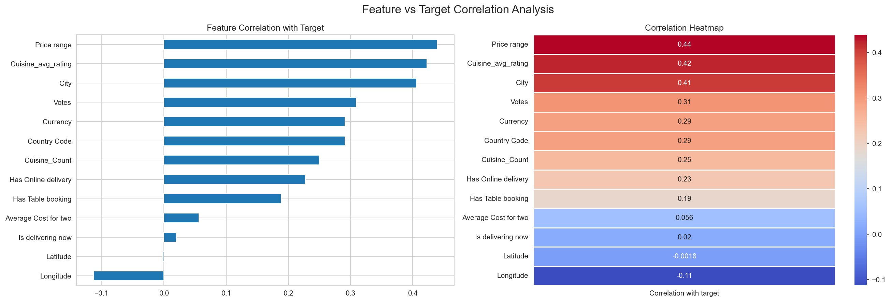

The engineered features dominate the feature-target correlation ranking:

- **`Price range`** (r = 0.44) — strongest single predictor; higher-tier restaurants consistently earn better ratings.
- **`Cuisine_avg_rating`** (r = 0.42) — custom feature built by target-encoding each cuisine with its mean rating; nearly as powerful as price range and represents the quality signal embedded in cuisine choice.
- **`City`** (r = 0.41) — target-encoded city captures strong geographic quality effects; where a restaurant operates matters independently of price and cuisine.
- **`Votes`** (r = 0.31) — more-engaged restaurants tend to be better-reviewed; engagement and quality reinforce each other.
- **`Has Online delivery`** (r = 0.23) and **`Has Table booking`** (r = 0.19) — modest but consistent positive signals.
- **`Longitude`** (r = -0.11) — slight negative correlation, a proxy for the geographic westward bias away from India's coordinates where higher-rated restaurants are more frequent.

---

### Location vs Rating Analysis

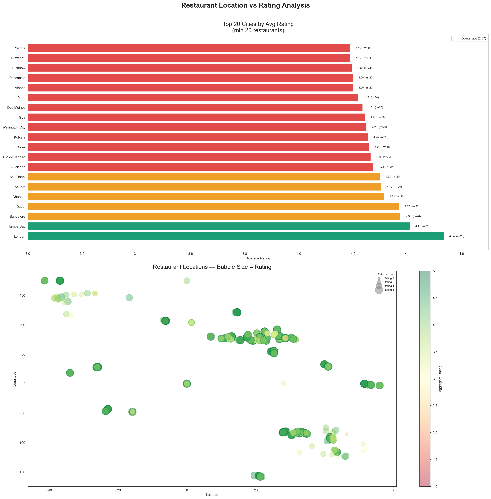

**London tops the city-level average rating ranking at 4.54**, followed by Tampa Bay (4.41) and Bangalore (4.38). Cities were filtered to those with at least 20 restaurants to ensure reliable averages. The global bubble chart reinforces the geographic story: darker green, larger bubbles — representing higher ratings — concentrate in South Asia (India) and the Middle East. The wide spread of average ratings across cities (from ~3.1 to 4.54) confirms that city-level encoding captures a genuine and substantial signal.

---

## 🤖 Modelling Summary

### Feature Engineering Pipeline

| Transformation | Columns Affected | Reason |
|---|---|---|
| Row removal | `Cuisines` (9 nulls) | Too few to impute reliably |
| Stratified train/test split (80/20) | All | Preserves rating bucket distribution across splits |
| Binary encoding (No→0, Yes→1) | `Has Table booking`, `Has Online delivery`, `Is delivering now`, `Switch to order menu` | Nominal binary columns |
| Target (mean) encoding | `City`, `Currency`, `Country Code`, `Cuisines` | High-cardinality categoricals; preserves rating signal without exploding dimensionality |
| Feature engineering | `Cuisine_Count` | Number of cuisines a restaurant serves — captures menu breadth as a diversity signal |
| `log1p` transformation | `Average Cost for two`, `Votes` | Corrects severe right skew and dampens extreme outlier influence |
| RobustScaler | `Longitude`, `Latitude`, `Average Cost for two`, `Votes` | Uses median + IQR; immune to the extreme outliers present in cost and votes |

---

### Model Benchmarking & Selection

Multiple regression models were benchmarked before hyperparameter tuning was applied to the top three performers (Gradient Boosting, Random Forest, XGBoost) via `RandomizedSearchCV`.

| Model | Notes |
|---|---|
| Linear Regression | Baseline — cannot capture non-linear feature interactions |
| Lasso / Ridge | Regularised linear; marginal improvement over baseline |
| Random Forest Regressor | Strong ensemble baseline; shortlisted for tuning |
| Gradient Boosting Regressor | Shortlisted for tuning |
| **XGBoost Regressor** | ✅ **Final selected model** |
| AdaBoost Regressor | Benchmarked; underperformed boosting alternatives |

### Final Model — XGBoost Regressor

```python
XGBRegressor(
    n_estimators=1000,
    max_depth=5,
    learning_rate=0.01,
    colsample_bytree=1,
    n_jobs=-1
)
```

XGBoost was selected for its ability to handle the mix of target-encoded categoricals and continuous features, its robustness to residual skew in the data, and its consistently superior performance across MAE, RMSE, and R² metrics during cross-validated evaluation.

---

## 🛠️ Tech Stack

| Category | Libraries |
|---|---|
| Data manipulation | `pandas`, `numpy` |
| Visualisation | `matplotlib`, `seaborn`, `plotly` |
| Machine learning | `scikit-learn`, `xgboost` |
| Notebook environment | `Jupyter Notebook` |
| Language | Python 3.13 |

---

## 💡 Key Takeaways

- **Price range is the strongest predictor** of restaurant rating (r = 0.44) — a clear, monotonic relationship exists where each tier up corresponds to a meaningfully higher average rating.
- **Cuisine type quality and popularity are largely decoupled.** Brazilian leads on average rating (4.34) with ~20 restaurants; North Indian leads on votes (596K) across 3,960 restaurants. Being popular does not mean being highly rated.
- **Target encoding for cuisines** produced `Cuisine_avg_rating` (r = 0.42 with target) — the second strongest predictor — demonstrating that thoughtful feature engineering outperforms naive one-hot encoding for high-cardinality categoricals.
- **Table booking is a consistent quality signal.** Restaurants accepting reservations average 0.18 points higher than those that don't, likely acting as a proxy for overall establishment quality rather than the feature itself causing better ratings.
- **Geography has strong independent predictive power.** City-level encoding ranks third in feature-target correlation (r = 0.41), confirming that location effects go beyond just price tier and cuisine.
- **XGBoost** with a disciplined feature engineering pipeline substantially outperformed all linear models, reflecting the non-linear, interaction-heavy nature of the rating prediction problem.

---
## ⚙️ Setup & Usage

# Initialize your credentials in .env file
-> kindly refer ***.env.example***

# Launch notebooks
jupyter notebook Notebooks/EDA/
> **Run notebooks in order: `01 → 02 → 03 → 04`**
> Notebooks 02–04 load from `Notebooks/processed_data/Dataset_filtered.csv` which is produced by Notebook 01.

```bash
# Create Conda Environment (recommended)
conda create -p venv python==3.12 -y  # virtual environment creation with python version 3.12
conda activate .\venv                 # activate conda environment
conda deactivate                      # to deactivate conda environment
# OR
# Create python environment
python -m venv venv                   # virtual environment creation with default python version installed in the system
venv\Scripts\activate                 # activate python environment
deactivate                            # to deactivate python environment

# Install dependencies
pip install -r requirements.txt

# To check database connection
python scripts/test_mongodb_connection.py

# To push Data into MongoDB
python scripts/push_data.py

# To train model
python scripts/run_training.py

# To run inference
python scripts/run_inference.py

# To run app
streamlit run app.py
---
